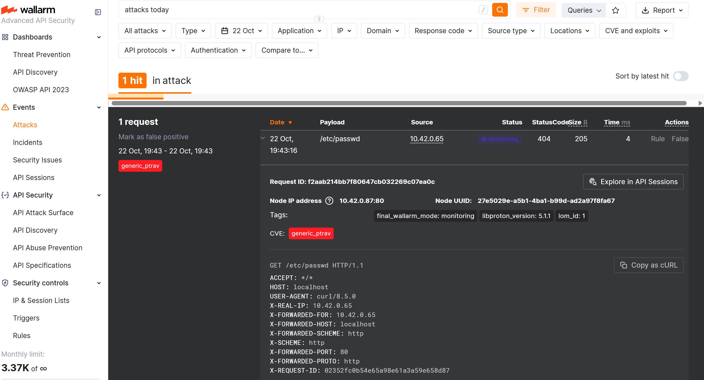

# Wallarm solution engineer challenge - solution

This README documents the steps taken to complete Wallarm technical solution architecture assignment. Additional troubleshooting.md is provided for further troubleshooting & debugging details.

# Summary

## High level walkthrough

- Local environment setup: Docker, Kubernetes, helm, nginx ingress controller (TLS not setup)
- Target API: https://github.com/erev0s/VAmPI
- Wallarm Deployment: Kubernetes nginx ingress controller chainer
- GoTestWaf docker runs; Wallarm in monitor and in block mode

## Test Result

When Wallarm mode was changed from monitor to block mode, GotTestWaf reported increased efficay from grade D- to A+

## Files & Folders

- `troubleshooting.md` - Troubleshooting details of encountered issues
- `k8s/vampi-namespace.yaml` - k8s namespace for the VAmPI app (`vampi-app`)
- `k8s/vampi-deployment.yaml` - k8s deployment for the VAmPI container
- `k8s/vampi-service.yaml` - k8s clusterIP Service exposing the VAmPI pod port
- `k8s/vampi-ingress.yaml` - k8s nginx ingress resource routing to VAmPI service
- `k8s/wallarm-values.yaml` - wallarm ingress controller helm deployment user values
- `k8s/vampi-wallarm-ingress-object.yaml` - wallarm ingress chainer / service facing
- `k8s/vampi-wallarm-ingress-forward.yaml` - Wallarm ingress chainer / vampi-ingress.yaml replacement
- `screenshots/` - screenshots used in this README
- `gotestwaf/` - GoTestWaf reports, openapi spec

## Deployment diagram

```mermaid
graph LR
    subgraph Internet
        User[👤 User / GoTestWaf Docker container]
    end

    subgraph "Kubernetes Cluster"
        subgraph "Entry Point"
            Nginx[🌐 NGINX Ingress<br/>Public Gateway]
        end
        
        subgraph "Security Layer"
            Wallarm[🛡️ Wallarm<br/>WAF & Threat Detection]
        end
        
        subgraph "Application"
            VAmPI[📱 VAmPI API<br/>Vulnerable API App]
        end
    end

    subgraph "Wallarm Cloud"
        Console[☁️ Wallarm Console<br/>Security Dashboard<br/>Attack Monitoring]
    end

    %% Traffic Flow
    User -->|1. Request| Nginx
    Nginx -->|2. Forward| Wallarm
    Wallarm -->|3. Filter & Inspect| VAmPI
    VAmPI -->|4. Response| Wallarm
    Wallarm -->|Return| Nginx
    Nginx -->|Return| User

    %% Cloud Communication
    Wallarm -.->|Report Attacks<br/>Send Telemetry| Console

    %% Styling
    classDef entry fill:#009639,stroke:#006d2c,color:#fff,stroke-width:3px
    classDef security fill:#ff6b35,stroke:#d94a1a,color:#fff,stroke-width:3px
    classDef app fill:#4a90e2,stroke:#2e5c8a,color:#fff,stroke-width:3px
    classDef cloud fill:#9b59b6,stroke:#6c3483,color:#fff,stroke-width:3px
    classDef user fill:#34495e,stroke:#2c3e50,color:#fff,stroke-width:3px

    class Nginx entry
    class Wallarm security
    class VAmPI app
    class Console cloud
    class User user
```



# Detailed walkthrough

## K8s (kubernetes) environment setup

### MacOS M3

Easiest way:
- Install Docker Desktop for Mac https://docs.docker.com/desktop/setup/install/mac-install/
- Enable single node kubernetes cluster in Docker Desktop UI
- Install homebrew https://brew.sh/
- Install helm using terminal: ```brew install helm```


Verification & version information

Helm version 3.19

```bash
helm version

version.BuildInfo{Version:"v3.19.0", GitCommit:"3d8990f0836691f0229297773f3524598f46bda6", GitTreeState:"clean", GoVersion:"go1.25.1"}
```

Docker version 28.5.1

```bash
docker -v

Docker version 28.5.1, build e180ab8
```

K8s version 1.34.1

```bash
kubetcl version

Client Version: v1.34.1
Kustomize Version: v5.7.1
Server Version: v1.34.1

kubectl get all -A

NAMESPACE     NAME                                         READY   STATUS    RESTARTS   AGE
kube-system   pod/coredns-66bc5c9577-fl25c                 1/1     Running   0          13m
kube-system   pod/coredns-66bc5c9577-gx6gm                 1/1     Running   0          13m
kube-system   pod/etcd-docker-desktop                      1/1     Running   0          13m
kube-system   pod/kube-apiserver-docker-desktop            1/1     Running   0          13m
kube-system   pod/kube-controller-manager-docker-desktop   1/1     Running   0          13m
kube-system   pod/kube-proxy-62m8x                         1/1     Running   0          13m
kube-system   pod/kube-scheduler-docker-desktop            1/1     Running   0          13m
kube-system   pod/storage-provisioner                      1/1     Running   0          13m
kube-system   pod/vpnkit-controller                        1/1     Running   0          13m

NAMESPACE     NAME                 TYPE        CLUSTER-IP   EXTERNAL-IP   PORT(S)                  AGE
default       service/kubernetes   ClusterIP   10.96.0.1    <none>        443/TCP                  13m
kube-system   service/kube-dns     ClusterIP   10.96.0.10   <none>        53/UDP,53/TCP,9153/TCP   13m

NAMESPACE     NAME                        DESIRED   CURRENT   READY   UP-TO-DATE   AVAILABLE   NODE SELECTOR            AGE
kube-system   daemonset.apps/kube-proxy   1         1         1       1            1           kubernetes.io/os=linux   13m

NAMESPACE     NAME                      READY   UP-TO-DATE   AVAILABLE   AGE
kube-system   deployment.apps/coredns   2/2     2            2           13m

NAMESPACE     NAME                                 DESIRED   CURRENT   READY   AGE
kube-system   replicaset.apps/coredns-66bc5c9577   2         2         2       13m
```

### Windows WSL / Ubuntu 24

Second setup (Intel based)
- Ubuntu 24.04 WSL (Windows Subsystem for Linux)
- k3s kubernetes (was running traefik and replaced it with nginx-ingress)
- helm
- docker

## Deploy k8s nginx-ingress controller

Install nginx-ingress controller using helm:

```bash
# Add repo
helm repo add ingress-nginx https://kubernetes.github.io/ingress-nginx
helm repo update

# Install into namespace ingress-nginx using Wallarm supported version
helm install ingress-nginx ingress-nginx/ingress-nginx --version 4.11.8 --namespace ingress-nginx --create-namespace
```

Verification -- please note curl nginx 404 error code is expected at this phase, as there are no backend apps/apis running & routes yet. We are simply verifying the ingress is up and working.

```bash
kubectl get service --namespace ingress-nginx
NAME                                 TYPE           CLUSTER-IP       EXTERNAL-IP   PORT(S)                      AGE
ingress-nginx-controller             LoadBalancer   10.99.146.215    localhost     80:31993/TCP,443:30535/TCP   119s
ingress-nginx-controller-admission   ClusterIP      10.102.154.113   <none>        443/TCP                      119s

curl -v http://localhost:80

* Host localhost:80 was resolved.
* IPv6: ::1
* IPv4: 127.0.0.1
*   Trying [::1]:80...
* Connected to localhost (::1) port 80
> GET / HTTP/1.1
> Host: localhost
> User-Agent: curl/8.7.1
> Accept: */*
> 
* Request completely sent off
< HTTP/1.1 404 Not Found
< Date: Wed, 22 Oct 2025 02:13:56 GMT
< Content-Type: text/html
< Content-Length: 146
< Connection: keep-alive
< 
<html>
<head><title>404 Not Found</title></head>
<body>
<center><h1>404 Not Found</h1></center>
<hr><center>nginx</center>
</body>
</html>
```

## Deploy target API app (VAmPI) and ingress routing to k8s

Target practice api/app is https://github.com/erev0s/VAmPI. VAmPI is a vulnerable API made with Python Flask and it includes vulnerabilities from the OWASP API top 10.

Steps:
- Create k8s namespace vampi-app.
- Deploy VAmPI pod & service (using docker image latest tag)
- Deploy nginx ingress rules to route host:80/ to VAmPI  

```bash
kubectl apply -f k8s/vampi-namespace.yaml
kubectl apply -f k8s/vampi-deployment.yaml
kubectl apply -f k8s/vampi-service.yaml
kubectl apply -f k8s/vampi-ingress.yaml
```

Verification (NOTE troubleshooting.md ISSUE #1)

```bash
kubectl get all -n vampi-app
kubectl get svc -n ingress-nginx
kubectl describe ingress -n vampi-app


NAME                                    READY   STATUS    RESTARTS   AGE
pod/vampi-deployment-77f96fff48-7qq9m   1/1     Running   0          7m23s
pod/vampi-deployment-77f96fff48-shpx6   1/1     Running   0          7m10s

NAME                    TYPE        CLUSTER-IP     EXTERNAL-IP   PORT(S)   AGE
service/vampi-service   ClusterIP   10.104.46.79   <none>        80/TCP    20m

NAME                               READY   UP-TO-DATE   AVAILABLE   AGE
deployment.apps/vampi-deployment   2/2     2            2           20m

NAME                                          DESIRED   CURRENT   READY   AGE
replicaset.apps/vampi-deployment-77f96fff48   2         2         2       7m23s
replicaset.apps/vampi-deployment-f7975f895    0         0         0       20m
NAME                                 TYPE           CLUSTER-IP       EXTERNAL-IP   PORT(S)                      AGE
ingress-nginx-controller             LoadBalancer   10.99.146.215    localhost     80:31993/TCP,443:30535/TCP   42m
ingress-nginx-controller-admission   ClusterIP      10.102.154.113   <none>        443/TCP                      42m
Name:             vampi-ingress
Labels:           <none>
Namespace:        vampi-app
Address:          localhost
Ingress Class:    nginx
Default backend:  <default>
Rules:
  Host        Path  Backends
  ----        ----  --------
  localhost   
              /   vampi-service:80 (10.1.0.11:5000,10.1.0.12:5000)
Annotations:  kubernetes.io/ingress.class: nginx
              nginx.ingress.kubernetes.io/proxy-body-size: 8m
              nginx.ingress.kubernetes.io/ssl-redirect: false
Events:
  Type    Reason  Age                From                      Message
  ----    ------  ----               ----                      -------
  Normal  Sync    20m (x2 over 20m)  nginx-ingress-controller  Scheduled for sync
```

Verify with curl VAmPI can be reached thru k8s nginx ingress.

```bash
curl -v http://localhost:80

* Host localhost:80 was resolved.
* IPv6: ::1
* IPv4: 127.0.0.1
*   Trying [::1]:80...
* Connected to localhost (::1) port 80
> GET / HTTP/1.1
> Host: localhost
> User-Agent: curl/8.7.1
> Accept: */*
> 
* Request completely sent off
< HTTP/1.1 200 OK
< Date: Wed, 22 Oct 2025 02:32:05 GMT
< Content-Type: application/json
< Content-Length: 271
< Connection: keep-alive
< 
* Connection #0 to host localhost left intact
{ "message": "VAmPI the Vulnerable API", "help": "VAmPI is a vulnerable on purpose API. It was created in order to evaluate the efficiency of third party tools in identifying vulnerabilities in APIs but it can also be used in learning/teaching purposes.", "vulnerable":1}

```

Environment is now fully functional and ready for Wallarm deployment and testing.

## Wallarm deployment

The environment offers two primary options to deploy Wallarm in-line (with real-time blocking capability) https://docs.wallarm.com/installation/supported-deployment-options/
- nginx ingress controller
- pod/docker sidecar

I decided to try out nginx ingress controller chaining option. Upsides:
- No need to replace existing nginx controller
- No need to deploy resource intensive sidecars
- Works locally without public IPs (cannot use CDN)

The downsides
- East-west (kubernetes service-to-service) communication is not secured.
- Chaining multiple controllers may introduce latency

Relevant documentation
- https://docs.wallarm.com/installation/inline/kubernetes/nginx-ingress-controller/
- https://docs.wallarm.com/admin-en/chaining-wallarm-and-other-ingress-controllers/
- https://docs.wallarm.com/admin-en/configure-kubernetes-en/#controllerwallarmexistingsecret

### Wallarm API token

Login and create a "node deployment token" at https://us1.my.wallarm.com/settings/api-tokens. 


### Wallarm k8s namespace, secret, nginx controller

Create Wallarm namespace.

```bash
kubectl create namespace wallarm
```

Create Wallarm token secret `wallarm-api-token` (replace `WALLARM_NODE_TOKEN` with the actual token) 

```bash
kubectl -n wallarm create secret generic wallarm-api-token --from-literal=token=<WALLARM_NODE_TOKEN>
```

Add Wallarm helm charts repo

```bash
helm repo add wallarm https://charts.wallarm.com
helm repo update
```

Configure k8s/wallarm-values.yaml and install to wallarm namespace

```bash
helm install --version 6.6.2 wallarm-controller wallarm/wallarm-ingress -n wallarm -f k8s/wallarm-values.yaml
```

Verification (after fixing issue #4 - encountered later)

```bash
ubectl get all -n wallarm
NAME                                                                  READY   STATUS    RESTARTS   AGE
pod/wallarm-controller-wallarm-ingress-controller-747b6d64fb-vl59m    3/3     Running   0          3m38s
pod/wallarm-controller-wallarm-ingress-controller-wallarm-wsto57vw6   3/3     Running   0          3m38s

NAME                                                                   TYPE        CLUSTER-IP     EXTERNAL-IP   PORT(S)          AGE
service/wallarm-controller-wallarm-ingress-controller                  ClusterIP   10.43.160.76   <none>        80/TCP,443/TCP   3m38s
service/wallarm-controller-wallarm-ingress-controller-admission        ClusterIP   10.43.231.81   <none>        443/TCP          3m38s
service/wallarm-controller-wallarm-ingress-controller-wallarm-wstore   ClusterIP   10.43.181.73   <none>        3313/TCP         3m38s

NAME                                                                           READY   UP-TO-DATE   AVAILABLE   AGE
deployment.apps/wallarm-controller-wallarm-ingress-controller                  1/1     1            1           3m38s
deployment.apps/wallarm-controller-wallarm-ingress-controller-wallarm-wstore   1/1     1            1           3m38s

NAME                                                                                      DESIRED   CURRENT   READY   AGE
replicaset.apps/wallarm-controller-wallarm-ingress-controller-747b6d64fb                  1         1         1       3m38s
replicaset.apps/wallarm-controller-wallarm-ingress-controller-wallarm-wstore-5464f6c74c   1         1         1       3m38s
```

### Routing traffic via wallarm nginx ingress

This step enables wallarm in-line monitoring and blocking. The ingress routing is modified from `nginx-ingress -> vampi-service` to `nginx-ingress (modified) -> wallarm-ingress -> vampi-service`

Configure and deploy `k8s/vampi-wallarm-ingress-object.yaml`

```bash
kubectl apply -f k8s/vampi-wallarm-ingress-object.yaml
```

(NOTE: Issue #2 namespace bug in troubleshooting.md)

Get the wallarm controller service name (`wallarm-controller-wallarm-ingress-controller`)

```bash
kubectl get svc -l "app.kubernetes.io/component=controller" -n wallarm -o=jsonpath='{.items[0].metadata.name}'
```

Configure `k8s/vampi-wallarm-ingress-forward.yaml`

Notably, make sure that in `k8s/vampi-wallarm-ingress-object.yaml`
- `spec.ingressClassName` matches the ingressClassName in `k8s/vampi-ingress.yaml`
- `spec.rules[0].http.paths[0].backend.service.name` matches the wallarm controller service name `wallarm-controller-wallarm-ingress-controller`

```yaml
spec:
  # must match nginx ingress controller class name
  ingressClassName: nginx
  rules:
    - host: localhost
      http:
        paths:
          - path: /
            pathType: Prefix
            backend:
              service:
                # must match wallarm ingress controller name installed via helm
                name: wallarm-controller-wallarm-ingress-controller
                port:
                  number: 80
```

Delete the original nginx-ingress (NOTE Issue #3 in troubleshooting.md)

```
kubectl delete ingress vampi-ingress -n vampi-app
```

Deploy modified nginx-ingress

```bash
kubectl apply -f k8s/vampi-wallarm-ingress-forward.yaml
```

### Verify Wallarm cloud connectivity

See Issue #4 in troubleshooting.md (embarrassing). After fixing it...

Verified that new node group 'satest' was created in Wallarm Web Console


Verified that a smoke test attack (```curl http://localhost:80/etc/passwd```) was detected.



## GoTestWaf runs

- VAmPI API spec https://github.com/erev0s/VAmPI/blob/master/openapi_specs/openapi3.yml downloaded to `gotestwaf/openapi3.yml`
- GoTestWaf docker usage https://github.com/wallarm/gotestwaf?tab=readme-ov-file#quick-start-with-docker
- Wallarm filtration mode docs https://docs.wallarm.com/admin-en/configure-wallarm-mode/

```bash
cd gotestwaf

docker pull wallarm/gotestwaf

# change wallarm mode to monitor (kubectl get ingress -A)
kubectl annotate ingress vampi-internal -n vampi-app nginx.ingress.kubernetes.io/wallarm-mode=monitoring --overwrite

# Run 1 with monitor mode
docker run --rm --network="host" -it -v "${PWD}"/reports:/app/reports -v "${PWD}"/openapi3.yml:/app/openapi3.yml wallarm/gotestwaf --wafName Wallarm_monitor --url=http://localhost:80 --openapiFile openapi3.yml --skipWAFBlockCheck --skipWAFIdentification --reportName vampi-wallarm-monitor --reportFormat html

# change wallarm mode to block
kubectl annotate ingress vampi-internal -n vampi-app nginx.ingress.kubernetes.io/wallarm-mode=block --overwrite

# Run 2 with block mode
docker run --rm --network="host" -it -v "${PWD}"/reports:/app/reports -v "${PWD}"/openapi3.yml:/app/openapi3.yml wallarm/gotestwaf --wafName Wallarm_block --url=http://localhost:80 --openapiFile openapi3.yml --skipWAFBlockCheck --skipWAFIdentification --reportName vampi-wallarm-block --reportFormat html
```

### Result - Wallarm in monitor mode


### Result - Wallarm in block mode


### Todo - authenticated test

Todo: registered user jwt token, pass it to gotestwaf and run authenticated

### Wallarm dashboard after testing

